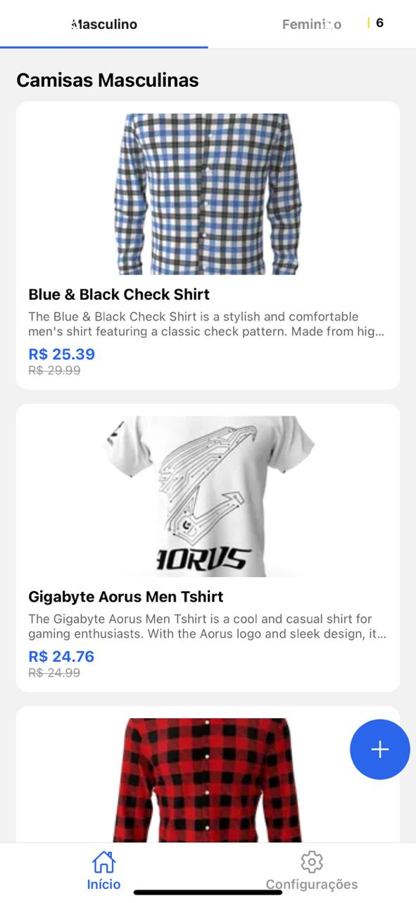
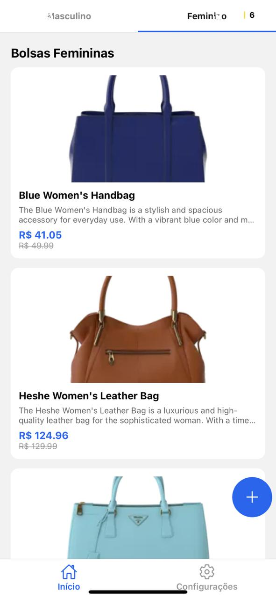
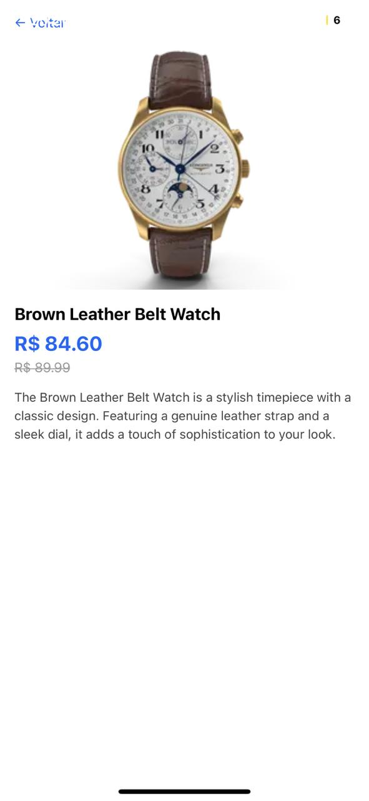

# 📱 Catálogo Mobile - React Native (Expo)

Aplicativo mobile desenvolvido com **React Native + Expo**, com simulação de login, listagem de produtos por categorias e consumo de API externa.

---

## 🚀 Funcionalidades

- 🔐 Tela de login com validação e armazenamento temporário de dados
- 👕 Listagem de produtos masculinos e femininos por abas
- 📦 Consumo de API externa (DummyJSON)
- 🔍 Tela de detalhes do produto com:
  - Imagem
  - Nome
  - Descrição
  - Preço original riscado
  - Preço com desconto
- 🔓 Logout funcional

---

## 📸 Prints do Aplicativo

### 🔐 Tela de Login


### 🔐 Campos Obrigatórios


### 🔐 Credenciais Inválidas


### 🏠 Produtos Masculinos


### 🏠 Produtos Femininos


### 📦 Descrição de Produto


### 🔓 Logout Funcional


---

## 🛠️ Tecnologias Utilizadas

- **React Native**
- **Expo**
- **Axios**
- **Context API (AuthContext)**
- **Expo Router**
- **DummyJSON API**

---

## 📡 API Utilizada

- Documentação: https://dummyjson.com/docs  
- Categorias:
  - Masculino: `mens-shirts`, `mens-shoes`, `mens-watches`
  - Feminino: `womens-bags`, `womens-dresses`, `womens-jewellery`, `womens-shoes`, `womens-watches`

---

## ▶️ Como executar o projeto

### Pré-requisitos:
- Node.js
- Expo CLI
- Git

### Passos:
```bash
git clone https://github.com/luisfcdev/catalogo-mobile-expo.git
cd catalogo-mobile-expo
npm install
npx expo start

---

## 🔑 Credenciais de Login

Este aplicativo utiliza **login simulado**, apenas para fins acadêmicos.

Username: admin
Senha: 1234